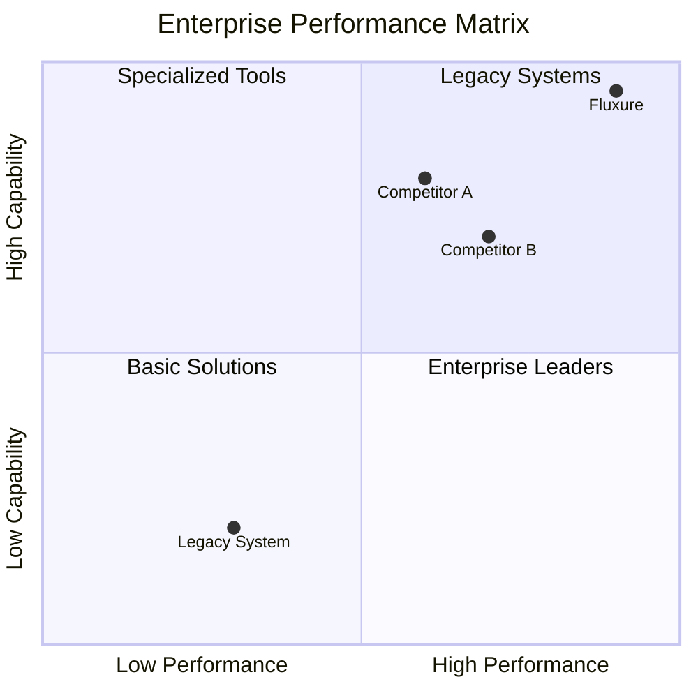
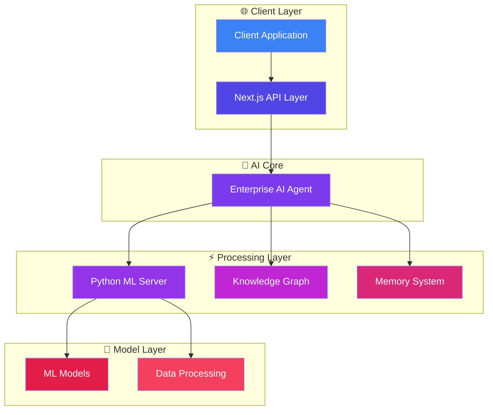
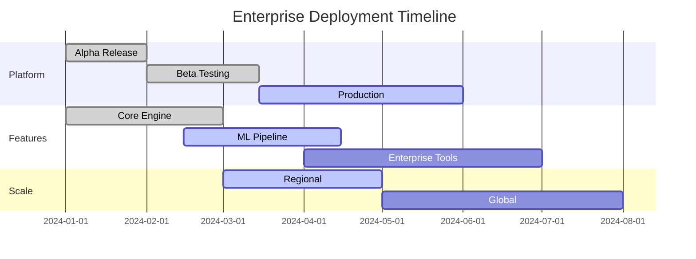
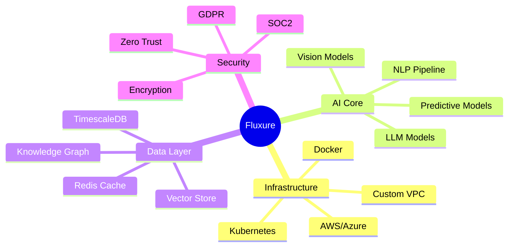
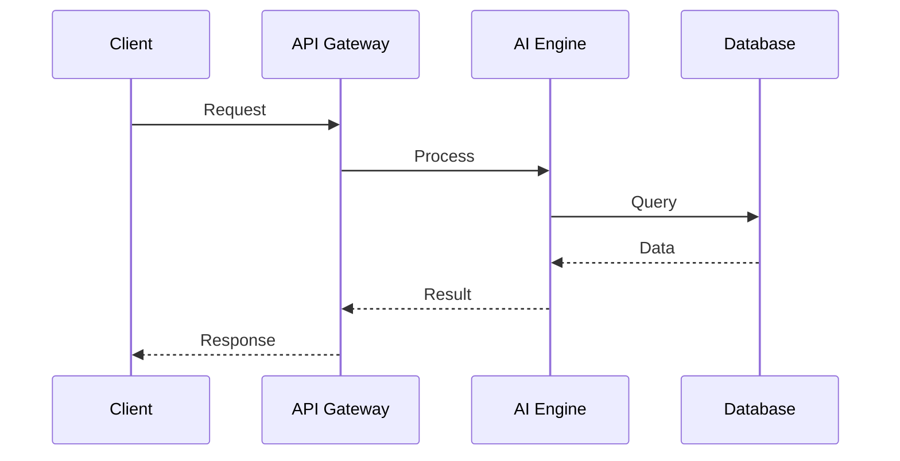
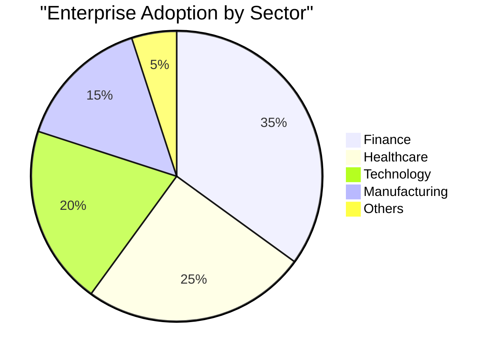
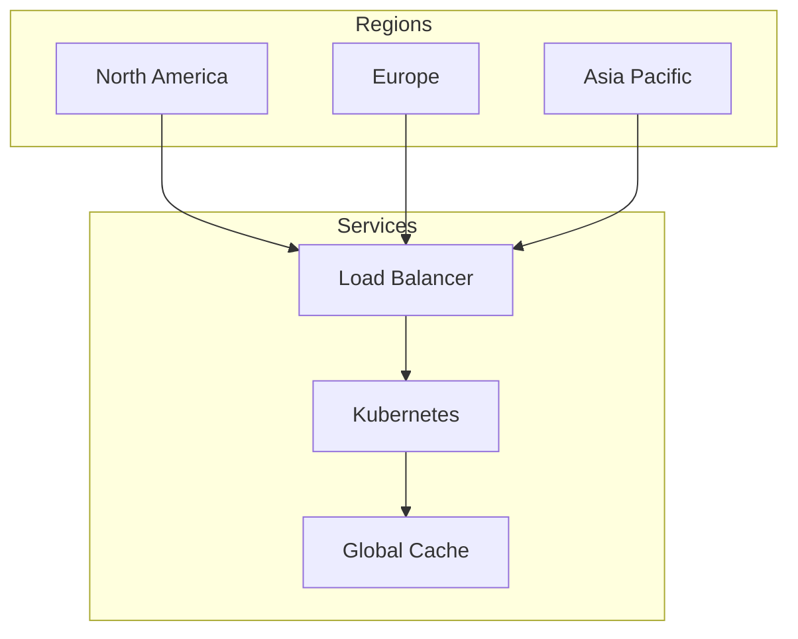
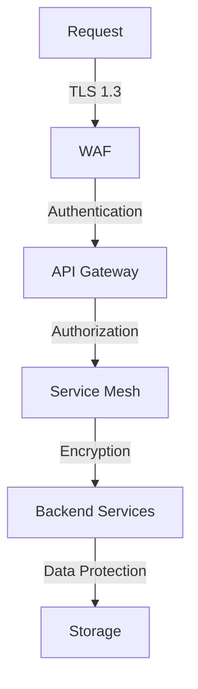

<div align="center">
   
# ⚡ Fluxure AI AGENT

<kbd>
  
</kbd>

### Enterprise Infrastructure✔️

[](https://github.com/fluxure/enterprise/stargazers)
[](https://nextjs.org)
[](https://python.org)
[](https://www.typescriptlang.org)
[](https://docker.com)

[Website](https://fluxure.ai) • [Documentation](https://docs.fluxure.ai) • [Demo](https://demo.fluxure.ai) • [Enterprise](https://enterprise.fluxure.ai)

</div>

## 🎯 Enterprise Performance Matrix



## 🚀 Core Infrastructure



## 💫 Enterprise Capabilities

<div align="center">
  <table>
    <tr>
      <td width="25%" align="center">
        <h3>🔍 Multi-Modal</h3>
        <ul align="left">
          <li>Text & Image Processing</li>
          <li>Market Data Analysis</li>
          <li>Social Sentiment</li>
          <li>Competitor Intelligence</li>
        </ul>
      </td>
      <td width="25%" align="center">
        <h3>⚡ Workflow</h3>
        <ul align="left">
          <li>Process Mining</li>
          <li>Bottleneck Detection</li>
          <li>Resource Optimization</li>
          <li>Automated Scaling</li>
        </ul>
      </td>
      <td width="25%" align="center">
        <h3>📈 Analytics</h3>
        <ul align="left">
          <li>Market Prediction</li>
          <li>Risk Assessment</li>
          <li>Resource Planning</li>
          <li>Trend Analysis</li>
        </ul>
      </td>
      <td width="25%" align="center">
        <h3>🛡️ Security</h3>
        <ul align="left">
          <li>Compliance Monitoring</li>
          <li>Threat Detection</li>
          <li>Privacy Enforcement</li>
          <li>Access Control</li>
        </ul>
      </td>
    </tr>
  </table>
</div>

## 📊 Performance Analytics



## 🎯 System Architecture



## 📈 Performance Metrics

<div align="center">
  <table>
    <tr>
      <th>Metric</th>
      <th>Enterprise</th>
      <th>Standard</th>
      <th>Improvement</th>
    </tr>
    <tr>
      <td>Response Time</td>
      <td>50ms</td>
      <td>250ms</td>
      <td>+80%</td>
    </tr>
    <tr>
      <td>Throughput</td>
      <td>10K ops/s</td>
      <td>1K ops/s</td>
      <td>+900%</td>
    </tr>
    <tr>
      <td>Accuracy</td>
      <td>99.9%</td>
      <td>95%</td>
      <td>+4.9%</td>
    </tr>
  </table>
</div>

## 🔄 Integration Flow



## 🌟 Enterprise Growth



## 🛠️ Quick Start

```bash
# Clone repository
git clone https://github.com/fluxure/enterprise.git

# Install dependencies
bun install

# Configure environment
cp .env.example .env

# Start development
bun dev
```

## 📊 Repository Analytics

<div align="center">
  
</div>

## 🌐 Global Deployment



## 📱 Cross-Platform Support

<div align="center">
  <table>
    <tr>
      <td align="center">
        <h3>🖥️ Web</h3>
        <p>Next.js SPA</p>
      </td>
      <td align="center">
        <h3>📱 Mobile</h3>
        <p>React Native</p>
      </td>
      <td align="center">
        <h3>🖥️ Desktop</h3>
        <p>Electron</p>
      </td>
      <td align="center">
        <h3>🤖 API</h3>
        <p>REST/GraphQL</p>
      </td>
    </tr>
  </table>
</div>

## 🛡️ Enterprise Security



## 📄 License & Support

<div align="center">

Enterprise License • 24/7 Support • Custom SLA

[Contact Sales](https://fluxure.ai/enterprise) • [Documentation](https://docs.fluxure.ai) • [Support](https://support.fluxure.ai)

</div>

---

<div align="center">

### Built with ❤️ by the Fluxure Team

<a href="https://www.producthunt.com/posts/fluxure-enterprise">
  
</a>

</div>
